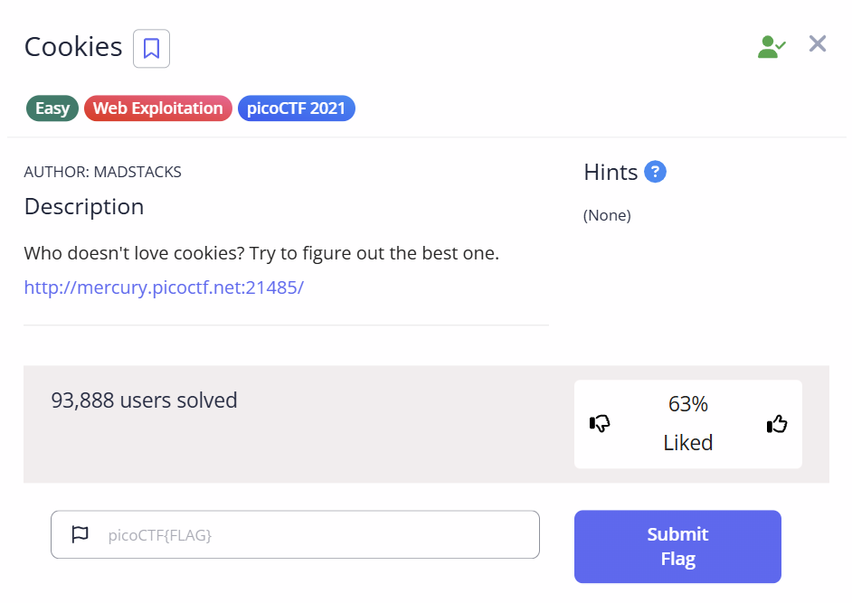
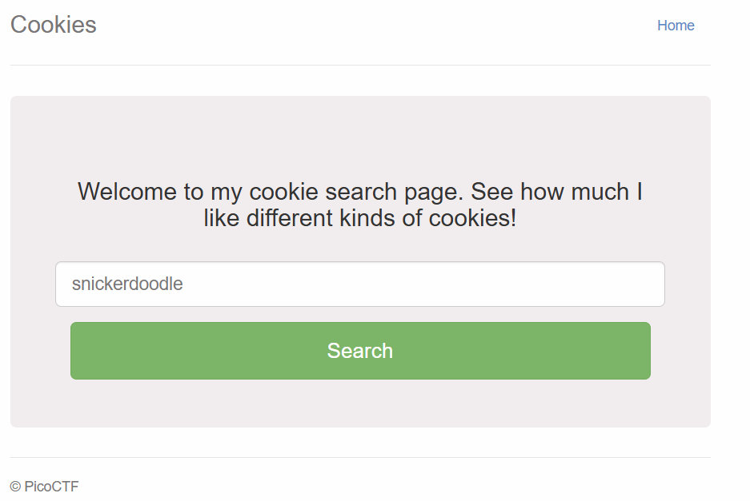
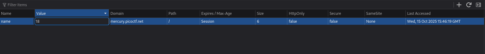
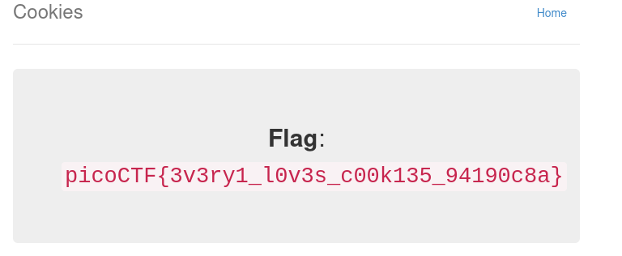

# Cookies

## Challenge Description

## Solution

In this challenge, we are shown a page which tells us to type a cookie name to check if the cookie is valid or not. At first, I typed a random cookie name like Oreo,etc. It replied with something like "I love Oreo cookies"

However, when I typed some other cookie name like Marie or anything, it says that the cookie is invalid.

I then inspected the page and went straight to the cookies as that is what the challenge is about.

I noticed in the cookies section that the value of the cookie is -1.

I then changed the value of the cookie to 2, and reloaded the page. The output displayed a cookie name.

So I changed the numbers until i reached 18, and VOILA!!!!! 

