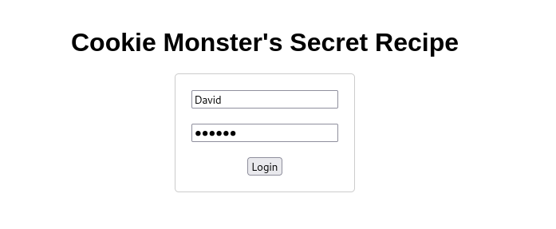

# Cookies Monster Secret recipe

## Challenge Description

## Solution

We are now greeted with a login page. I entered a random name and a random number for password. It displayed a message saying that whether i checked my cookies or not?

I then inspected the webpage and check for my cookies. I noticed that the cookies value was of an encoded form. I then founded out that the cookie value is encoded as a url. 

So i opened my Burpsuite, Fired up the decoder, and pasted my cookie value to the field and i decoded as URL followed by Base64.

The Flag is then Revealed!!!!

