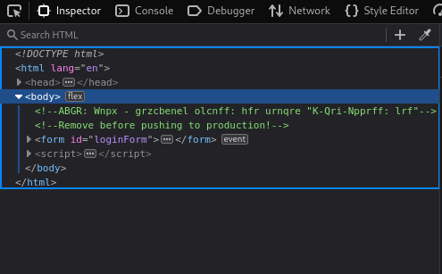
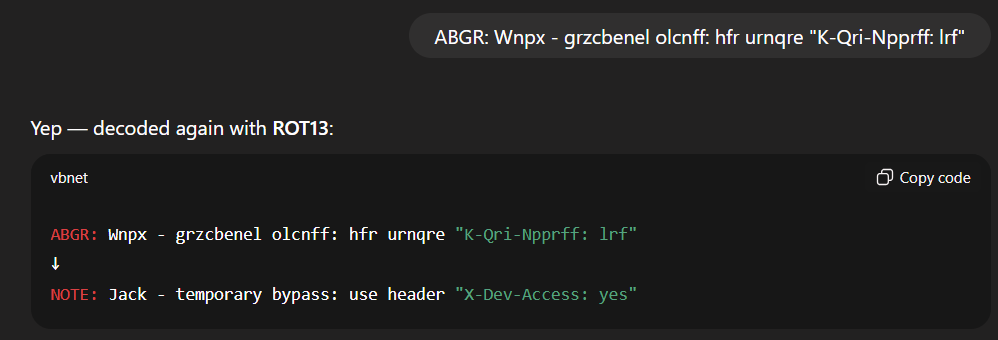
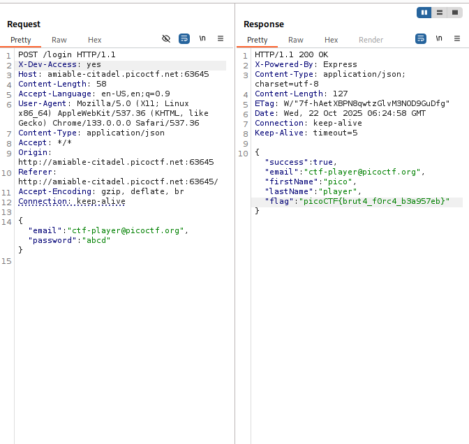

# Crack The Gate 1

## Challenge Description

## Solution

The challenge presents a login page with the known email ctf-player@picoctf.org but no password. I tried a random password in the UI which returned an “Invalid credentials” message.

I then inspected the webpage and found a message. It felt like Ceasar first. 

So I checked with the help of Chatgpt. It then found out that its ROT13 message!! And the message says about Temporary bypass using X-Dev-Access.

I then opened my Burpsuite, intercepted the request, and added the request header "X-Dev-Access: Yes". The response came with a Flag!!!!!!

