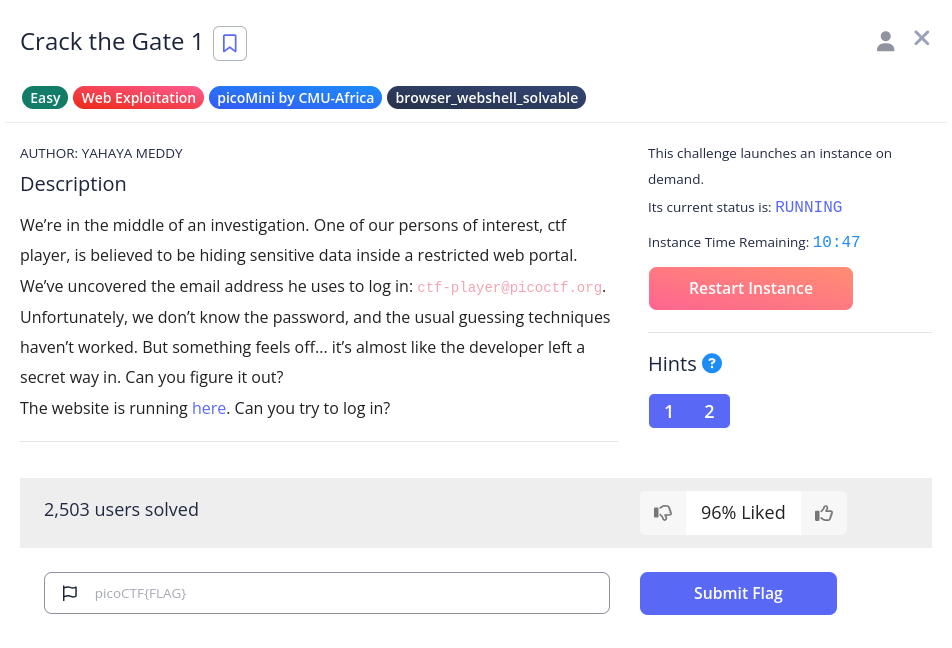
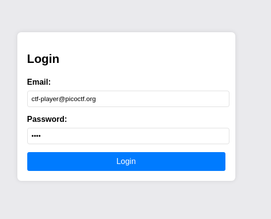
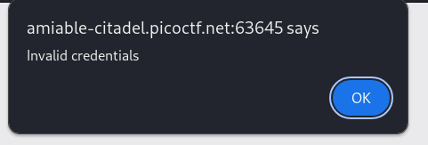

# Crack The Gate 1

## Challenge Description

## Solution

The challenge presents a login page with the known email ctf-player@picoctf.org but no password. I tried a random password in the UI which returned an “Invalid credentials” message.

I then inspected the webpage and check for my cookies. I noticed that the cookies value was of an encoded form. I then founded out that the cookie value is encoded as a url. 

So i opened my Burpsuite, Fired up the decoder, and pasted my cookie value to the field and i decoded as URL followed by Base64.

The Flag is then Revealed!!!!

