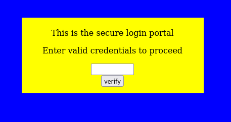
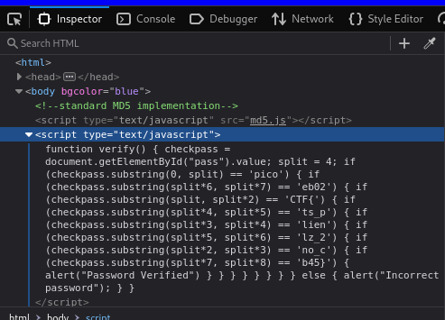
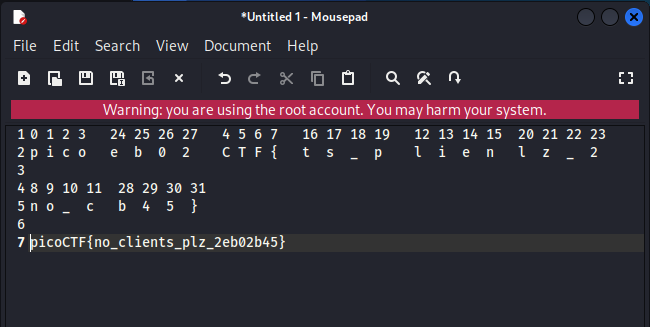

# Dont Use Client Side

## Challenge Description

## Solution

The challenge presents a page with an input bar and a text saying "Input Valid Credentials". When entering something, the output is shown as invalid.

I then inspected the page and found a JavaScript script and a text indicating its a simple MD5 implementation.

There is a variable "Split" and parameters containing Numbers and letters. By looking at it, i came to know that the numbers indicates letters.

I then arranged the numbers in ascending order and the corresponding alphabets got arranged to form the "flag"

