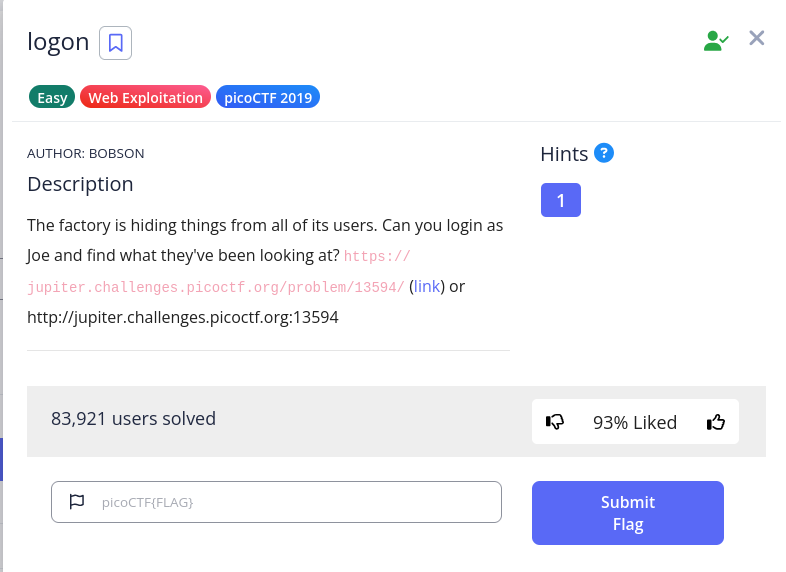
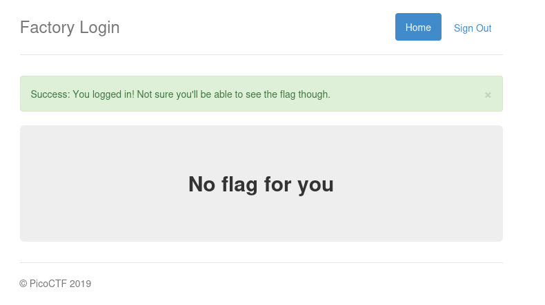
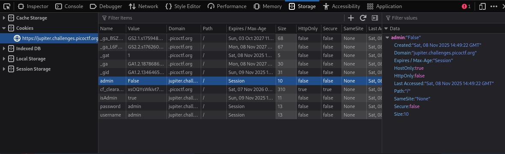
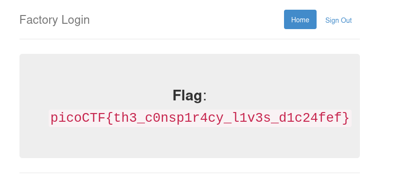

# Logon

## Challenge Description

## Solution

The challenge presents a login page. I first input username a Joe and password as something random.
It failed!!!

I then tried to use another username to check if the login form was only limited to Joe. I typed some other random name in the username section and password as something different. I logged in, but the flag was not shown.

SO, somehow I logged in, that too a random password. That means the login form is really not secure and is only targeted to Joe. Now, to get the flag, I must analyze more. I went to the storage section of the developers mode to check for the cookies if there are any admin related cookies. I noticed one section called"admin" and the value is set to "False". Me being curioius what would happen if I set to "True", I did the needful.

I refreshed the page and BOOM!!!! THE FLAG!!!!

