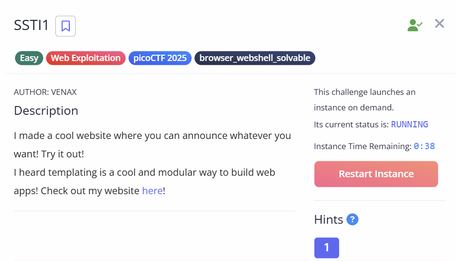
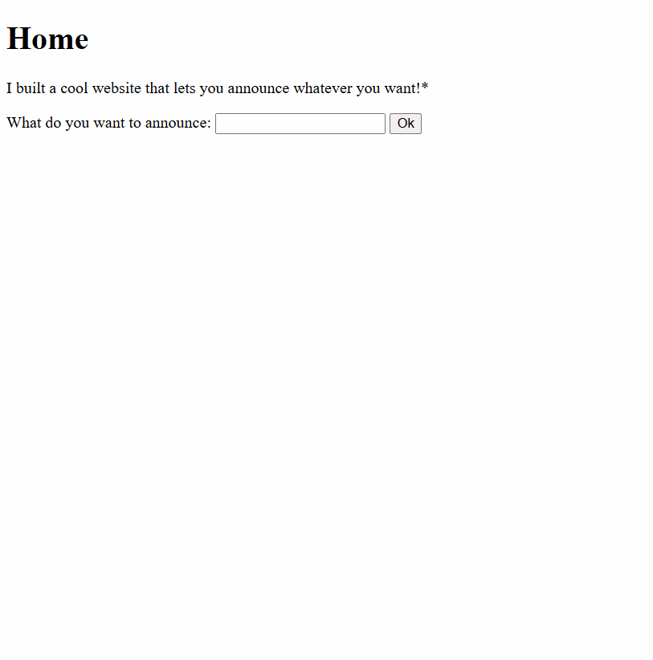
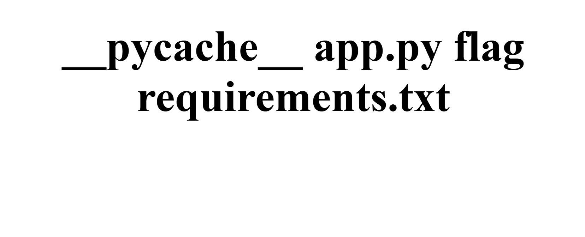

# SSTI 1 - PicoCTF Web Exploitation Challenge

## Challenge Description

## Solution

When entering, we are greeted with a web page that let us announce the input which we entered. At first, i just put a random word like "Hello", as expected, the website outputed the word Hello on the page. 

I then tried to perform an XSS attack by typing . But, it didnt showed any changes. When i clicked for the hint, it says something about Server Side Template Injection. Being a beginner as i am, I Googled, went to chatgpt, to search for the explanation. 

I then realized that SSTI is a type of vulnerability where we can Remotely execute a command for the server to execute remotely to reveal files which cannot be accessed normally. 

In order to that, first we need to check for the type of template the server is using. By typing {{7+7}} or any arithmetic operation, if the webpage return any output, that means the server is vulnerable to SSTI attack. Also, the server uses Jinja, which is a python based server. 

When executing, the webpage did return the sum of the numbers. So, I searched for the payload using various forums and google answers. 

the payload i found is :

{{ self._TemplateReference__context.cycler.__init__.__global__.os.popen('ls').read() }}

By doing this, the website has listed various files which is not supported if its protected. I then saw the flag file and change the popen command to cat flag.

The flag is then displayed.

