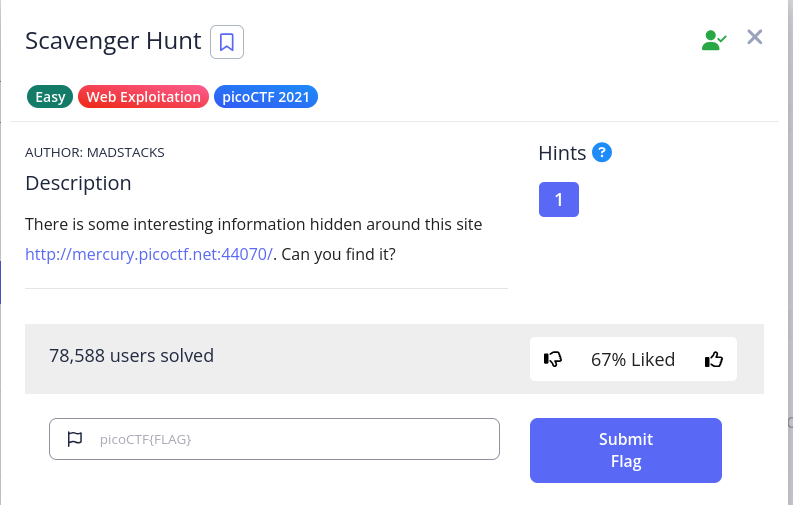
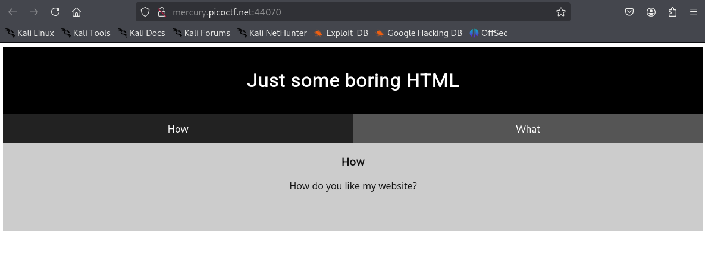
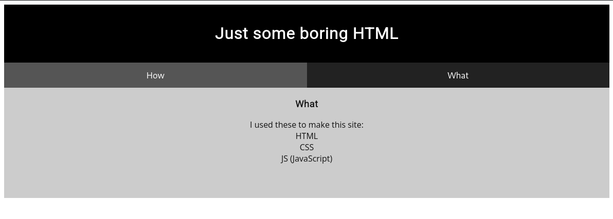
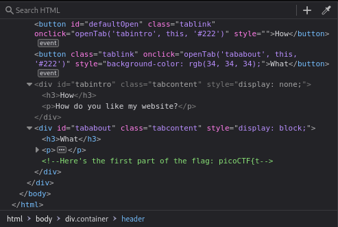
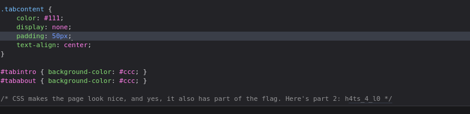
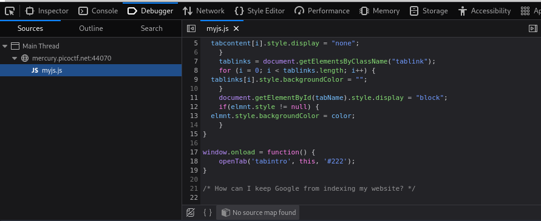
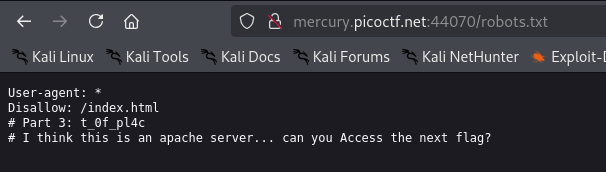
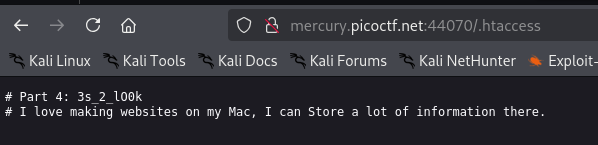
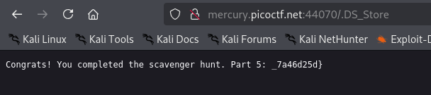

# Scavenger Hunt

## Challenge Description

## Solution

We are shown a webpage with 2 interactions : THe HOW??? and the WHAT???

When clicked on "WHAT?", it shows that the webpage is made using HTML,CSS and JAVASCRIPT.

Without further ado, I inspected the HTML part. Got the first part of the flag!!!!

Next I went to CSS part, got the second part of the flag there!!!!

Then I went to JAVASCRIPT part. I just got the question asking this......

I knew the answer is Robots files. So I typed robots.txt in the searchbar as an extension. BOOM!!!! Flag no: 3!!!

Next, it says that the website uses Apache server. That means it has a .htaccess file. 

I typed that as extension in the url and BOOM!!!! Flag no: 4!!!!

Next it says that the creator loves Mac. To be honest, I didnt knew what that was , So I googled and it reveals that Mac uses .DS_Store to store files!!!!

So I typed that as extension into the URL.....and BOOM!!!!! THE FINAL PART OF THE FLAG!!!!!

THIS WAS A FUN CHALLENGE NGL!!!!

