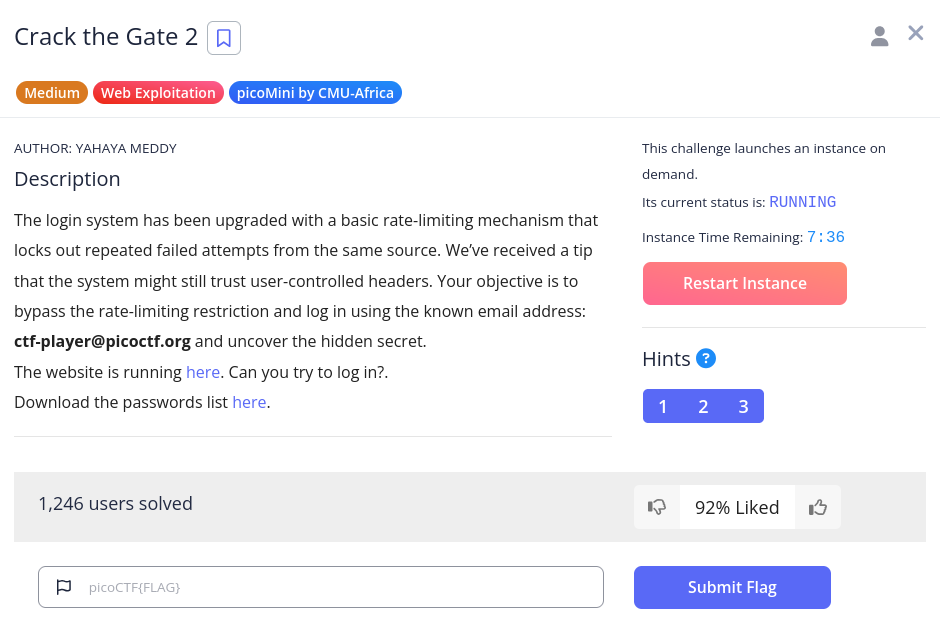
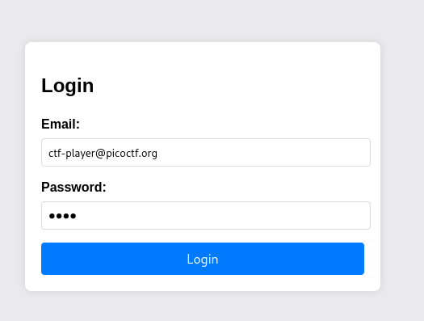
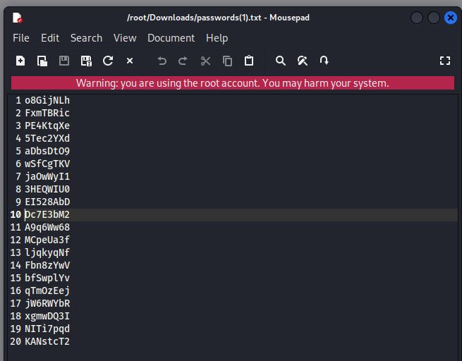
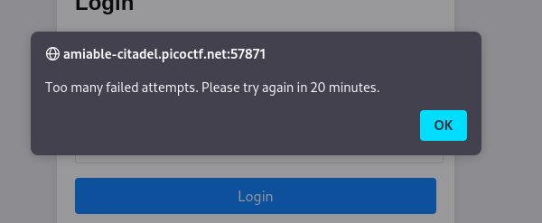
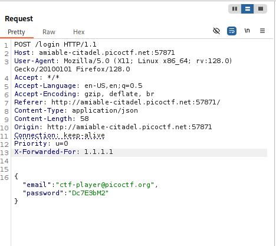
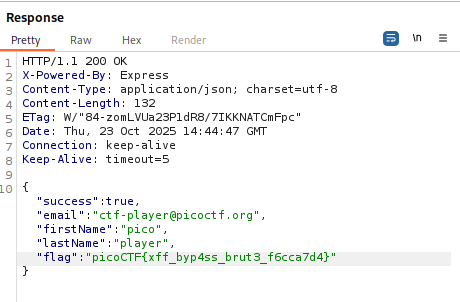

# Crack The Gate 2

## Challenge Description

## Solution

We are now greeted with a login page. I entered the email address provided in the description and the password from the password list provided in the description. When I entered the first password in the list, I got the invalid credential message from the server. However, as I entered the next password in the list, the timeout message has popped, which is expected as the page is now improved from the Crack The Gate 1 problem with a limiter.

I then checked the hints and it says something about X-Forwarded-For. After researching, I found out that the X-Forwarded-For is a header used to identify various ip addresses the client used to interact with the website. These various IPs are nothing but proxies which the client used to interact with the page. After reading and learning about it, I then opened my Burpsuite, intercepted the login request, forwarded to the repeater, and added the X-Forwarded-For request header along with a fake IP address like 1.1.1.1, 2.2.2.2, 1.2.3.4, etc.

With changing IPs, I also keep changing the password and tried each password form the password list. After each trial, i found the password and VOIILA, the flag is found.

